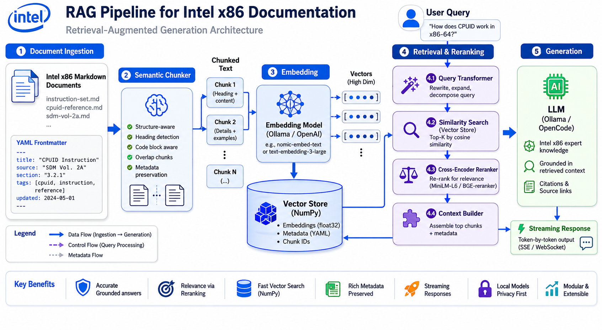

# RAG Intel x86 32-bit

**Retrieval-Augmented Generation system specialized in low-level Intel x86 32-bit programming for Protected Mode development.**

[](https://www.python.org/downloads/)
[](https://opensource.org/licenses/MIT)
[](https://github.com/yourusername/RAGIntelx86)
[](https://github.com/psf/black)

---

##  Overview

Commercial LLMs struggle with low-level hardware programming due to scarce training data and lack of physical context. **RAG Intel x86 32-bit** solves this by combining verified Intel SDM documentation with semantic retrieval, eliminating hallucinations in critical system programming tasks.

> **Use case:** "How do I configure a GDT descriptor for kernel code segment?" → Get accurate, citation-backed answers from the official Intel manual.

---

## 🖼️ Architecture Diagram

<!-- 
PROMPT FOR IMAGE GENERATION:
"Technical architecture diagram showing a RAG (Retrieval-Augmented Generation) pipeline for Intel x86 documentation. 
Left side: Markdown documents with YAML frontmatter flowing into a 'Semantic Chunker' box. 
Center: Chunked text entering an 'Embedding Model (Ollama/OpenAI)' box, outputting vectors to a 'Vector Store (NumPy)' cylinder. 
Right side: User query entering 'Query Transformer', then 'Similarity Search', then 'Cross-Encoder Reranker', 
finally 'Context Builder' feeding into 'LLM (Ollama/OpenCode)' with streaming response output. 
Use clean technical diagram style with blue/gray color scheme, arrows showing data flow, 
and icons for documents, databases, and AI models. Professional documentation style."
-->



---

## ✨ Features

- **🔄 Interchangeable Embeddings** — Local (sentence-transformers), Ollama, OpenAI
- **🤖 Multiple LLM Providers** — Ollama local, OpenCode GO (OpenAI + Anthropic compatible)
- **📄 Semantic Chunking** — Markdown parser with YAML frontmatter, code/explanation separation, type-aware overlap
- **🎯 Cross-Encoder Re-ranking** — Improves retrieval precision with `ms-marco-MiniLM-L-6-v2`
- **💭 HyDE Query Transformation** — Optional hypothetical document embeddings
- **🏷️ Metadata Filtering** — Filter by component, architecture, mode, tags
- **⚡ Context Budget** — Automatic truncation to prevent LLM overflow
- **💾 Embedding Cache** — SHA256-based persistence, invalidates on model change
- **🧪 32 Unit Tests** — Full coverage of cache, vectorstore, chunker, reranker, hyde, LLM clients

---

## 🚀 Quick Start

### Prerequisites

- Python 3.10+
- At least one embedding provider (local/Ollama/OpenAI)
- At least one LLM provider (Ollama/OpenCode)

### Installation

```bash
# Clone repository
git clone https://github.com/yourusername/RAGIntelx86.git
cd RAGIntelx86

# Create virtual environment
python3 -m venv venv
source venv/bin/activate  # Linux/macOS
# venv\Scripts\activate   # Windows

# Install dependencies
pip install -r requirements.txt
```

### Configuration

All configuration is done via `.env` file. Copy the template and customize:

```bash
cp .env.example .env
```

**Full `.env` reference:**

```bash
# --- Logging ---
LOG_LEVEL=INFO

# --- Embedding Provider ---
# Options: local, ollama, openai
EMBEDDING_PROVIDER=ollama
EMBEDDING_MODEL=qwen3-embedding:0.6b

# --- LLM Provider ---
# Options: ollama, opencode, claude
LLM_PROVIDER=opencode

# Ollama settings
OLLAMA_MODEL=gemma4:e4b-it-qat
OLLAMA_BASE_URL=http://localhost:11434

# OpenCode settings
OPENCODE_MODEL=kimi-k2.6
# OPENCODE_API_TYPE=  # "openai" or "anthropic" to override auto-detection

# Claude settings
CLAUDE_MODEL=claude-sonnet-4-20250514

# --- API Keys ---
OPENAI_API_KEY=
OPENCODE_API_KEY=
ANTHROPIC_API_KEY=

# --- Retrieval Parameters ---
TOP_K=10                    # Candidates for reranker
SIMILARITY_THRESHOLD=0.3    # Min cosine similarity (0.0-1.0)
RERANK_ENABLED=true         # Enable cross-encoder re-ranking
RERANK_MODEL=cross-encoder/ms-marco-MiniLM-L-6-v2
RERANK_TOP_K=3              # Final results after rerank
HYDE_ENABLED=false          # Hypothetical Document Embeddings

# --- Context Budget ---
CONTEXT_TOKEN_BUDGET=3000   # Max tokens sent to LLM
CHARS_PER_TOKEN=4           # Estimation factor (chars  this = tokens)

# --- Debug ---
DEBUG_SHOW_CONTEXT=false    # Show retrieved fragments in stderr

# --- Custom System Prompt (optional) ---
# SYSTEM_PROMPT=You are an expert firmware engineer...
```

**Key variables explained:**

| Variable | Description | Default |
|----------|-------------|---------|
| `EMBEDDING_PROVIDER` | Embedding backend (`local`, `ollama`, `openai`) | `ollama` |
| `EMBEDDING_MODEL` | Model name for embeddings | `qwen3-embedding:0.6b` |
| `LLM_PROVIDER` | LLM backend (`ollama`, `opencode`, `claude`) | `opencode` |
| `TOP_K` | Number of candidates retrieved before reranking | `10` |
| `SIMILARITY_THRESHOLD` | Min similarity score to include results | `0.3` |
| `RERANK_ENABLED` | Enable cross-encoder re-ranking | `true` |
| `RERANK_TOP_K` | Final results after reranking | `3` |
| `HYDE_ENABLED` | Transform query into hypothetical document | `false` |
| `CONTEXT_TOKEN_BUDGET` | Max tokens sent to LLM (prevents overflow) | `3000` |
| `DEBUG_SHOW_CONTEXT` | Print retrieved fragments to stderr | `false` |

**Example: Switch from Ollama to Claude**

```bash
# In .env
LLM_PROVIDER=claude
CLAUDE_MODEL=claude-sonnet-4-20250514
ANTHROPIC_API_KEY=sk-ant-api03-...
```

No code changes needed. The system reads `.env` automatically.

### Usage

**Index documents (first time or after changes):**

```bash
python rag.py index
```

**Query the knowledge base:**

```bash
python rag.py query "How do I set up a GDT descriptor?"
```

**Example output:**

```
================================================================================
ANSWER:
================================================================================
[Thinking]
The user is asking about GDT descriptor configuration...

[Response]
According to the Intel SDM Volume 3, a GDT segment descriptor is configured as follows:

Base: 0x00000000
Limit: 0xFFFFF (with G=1, this is 4GB)
Access: 0x9A (Present=1, DPL=0, Code, Execute/Read)
Flags: 0xC (G=1, D=1)

In NASM assembly:
```nasm
dw 0xFFFF       ; Limit [15:0]
dw 0x0000       ; Base [15:0]
db 0x00         ; Base [23:16]
db 10011010b    ; Access: Present, DPL=0, Code, Execute/Read
db 11001111b    ; Flags (G=1, D=1) + Limit [19:16]
db 0x00         ; Base [31:24]
```

[Fragment 1] (similarity: 0.71)
```

---

## 📚 Preparing Documents

Documents go in `data/curated/` with YAML frontmatter:

```markdown
---
architecture: x86_32
component: GDT
mode: protected
tags: [segmentation, memory, descriptors]
---

# GDT - Global Descriptor Table

The Global Descriptor Table (GDT) is a data structure...

## Segment Descriptor Format

```nasm
; Example code
mov eax, cr0
or eax, 1
mov cr0, eax
```
```

**Chunking behavior:**
- Code blocks automatically split into `type: "code"` chunks
- Explanation text becomes `type: "explanation"` chunks
- Overlap (default 3 lines) only applies between same-type chunks
- Fragments < 50 chars filtered out

---

## 🏗️ Architecture

```
[ Markdown Docs ] → [ MarkdownChunker ] → [ Semantic Chunks ]
                                                ↓
[ LLM Response ] ← [ RAGSystem ] ← [ VectorStore (NumPy) ]
(Ollama/Claude/       ↑                     ↓
 OpenCode)       [ Reranker ]        [ EmbeddingCache ]
                [ HyDE (opt) ]      [ Embedder ]
```

### Components

| Module | Description |
|--------|-------------|
| `chunker/` | Semantic Markdown parser with YAML frontmatter |
| `embedder/` | Embedding providers (local, Ollama, OpenAI) + cache |
| `vectorstore/` | NumPy-based vector store with cosine similarity |
| `llm/` | LLM clients (Ollama, OpenCode) with streaming |
| `reranker/` | Cross-encoder re-ranking for precision |
| `retrieval/` | HyDE query transformation |

---

## ⚙️ Configuration Reference

### Embedding Providers

| Provider | Model Example | Dimension | Requirements |
|----------|--------------|-----------|--------------|
| `local` | `all-MiniLM-L6-v2` | 384 | None (auto-download) |
| `ollama` | `qwen3-embedding:0.6b` | 1024 | Ollama running |
| `openai` | `text-embedding-3-small` | 1536 | `OPENAI_API_KEY` |

### LLM Providers

| Provider | Model Example | API Type | Requirements |
|----------|--------------|----------|--------------|
| `ollama` | `gemma4:e4b-it-qat` | Ollama | Ollama running |
| `opencode` | `kimi-k2.6` | OpenAI-compatible | `OPENCODE_API_KEY` |
| `opencode` | `qwen3.7-max` | Anthropic-compatible | `OPENCODE_API_KEY` |
| `claude` | `claude-sonnet-4-20250514` | Anthropic | `ANTHROPIC_API_KEY` |

### Retrieval Parameters

```python
TOP_K = 10                      # Candidates for reranker
SIMILARITY_THRESHOLD = 0.3      # Min cosine similarity
RERANK_ENABLED = True            # Cross-encoder re-ranking
RERANK_TOP_K = 3                # Final results after rerank
HYDE_ENABLED = False             # Hypothetical document embeddings
CONTEXT_TOKEN_BUDGET = 3000      # Max context tokens
CHARS_PER_TOKEN = 4              # Token estimation
```

---

## 📁 Project Structure

```
RAGIntelx86/
├── rag.py                    # Main CLI and orchestrator
├── config.py                 # Central configuration
├── logger.py                 # Logging setup
├── .env.example              # API keys template
├── requirements.txt          # Runtime dependencies
├── requirements-dev.txt      # Dev dependencies (pytest)
├── README.md                 # This file
├── CONTEXT.md                # Project context and roadmap
├── data/
│   └── curated/              # Curated .md documents
├── embedder/
│   ├── base.py               # Embedder ABC
│   ├── local.py              # sentence-transformers
│   ├── ollama.py             # Ollama API
│   ├── openai_client.py      # OpenAI API
│   └── cache.py              # SHA256-based cache
├── vectorstore/
│   └── store.py              # NumPy vector store
├── chunker/
│   └── markdown.py           # Semantic chunker
├── llm/
│   ├── base.py               # LLMClient ABC
│   ├── ollama.py             # Ollama client
│   ├── opencode.py           # OpenCode client
│   └── claude.py             # Claude client
├── reranker/
│   └── reranker.py           # Cross-encoder reranker
├── retrieval/
│   └── hyde.py               # HyDE transformer
├── tests/                    # Unit tests (32/32 passing)
└── storage/                  # Auto-generated (gitignored)
    ├── vectors.npy
    ├── texts.json
    ├── metadata.json
    └── cache/
```

---

##  Troubleshooting

### "Stored vector dimension does not match"

**Cause:** Changed embedding model without re-indexing.

**Solution:**
```bash
python rag.py index
```

### "Could not connect to Ollama"

**Cause:** Ollama not running.

**Solution:**
```bash
ollama serve
# or check: curl http://localhost:11434/api/tags
```

### "Invalid API key"

**Cause:** Missing or incorrect API key in `.env`.

**Solution:**
1. Verify `.env` exists with correct keys
2. Reload environment: `source venv/bin/activate`

### Results not relevant

**Possible causes:**
1. Embedding model too basic → Try larger model
2. Threshold too high/low → Adjust `SIMILARITY_THRESHOLD`
3. Poorly curated docs → Verify frontmatter and content
4. Re-ranking disabled → Set `RERANK_ENABLED = True`

---

## 🧪 Testing

```bash
# Install dev dependencies
pip install -r requirements-dev.txt

# Run all tests
pytest tests/ -v

# Run specific test
pytest tests/test_chunker.py -v
```

**Coverage:**
- `test_cache.py` — Embedding cache (4 tests)
- `test_chunker.py` — Markdown parser (5 tests)
- `test_hyde.py` — HyDE transformer (2 tests)
- `test_reranker.py` — Cross-encoder reranker (3 tests)
- `test_vectorstore.py` — Vector store (5 tests)
- `test_llm.py` — LLM clients (Ollama, OpenCode) (9 tests)
- `test_rag.py` — RAG system integration (4 tests)

---

## 📖 Concepts Covered

- **Architecture:** Intel x86 32-bit, Protected Mode
- **Structures:** GDT, IDT, Paging, Control Registers (CR0, CR2, CR3)
- **Instructions:** `lgdt`, `lidt`, `iret`, `cli`, `sti`, `in/out`, EFLAGS
- **Memory Management:** Segmentation, Page Directory, Page Tables

---

## 🗺️ Roadmap

- [x] Phase 1: Seed dataset (GDT documentation)
- [x] Phase 2: Local vector pipeline (embedding, storage, search)
- [x] Phase 3: CLI interface and LLM integration
- [x] Phase 4: Re-ranking and HyDE
- [ ] Phase 5: Expand knowledge base (IDT, Paging, more SDM volumes)
- [ ] Phase 6: Agent with compilation loop (NASM/GCC integration)

---

## 🤝 Contributing

Contributions welcome! Please:

1. Fork the repository
2. Create a feature branch (`git checkout -b feature/amazing-feature`)
3. Run tests (`pytest tests/ -v`)
4. Commit changes (`git commit -m 'Add amazing feature'`)
5. Push to branch (`git push origin feature/amazing-feature`)
6. Open a Pull Request

---

## 📄 License

MIT License — see LICENSE file for details.

---

## 🙏 Acknowledgments

- Intel Corporation for the Software Developer's Manual
- Ollama for local LLM inference
- sentence-transformers for embedding models
- The open-source AI community

---

**Built for low-level developers who demand precision.**
